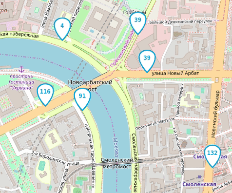

# Buses on the map

Web application shows the movement of buses on the map of Moscow.  

Project uses web sockets ([trio-websocket](https://github.com/HyperionGray/trio-websocket)) 
based on [Trio](https://github.com/python-trio/trio) async implementation.  


## How to install

Python version required: `3.8`
* It's recommended to use `venv` or `virtualenv` for better isolation.  
`venv` setup example:
```
python3 -m venv env
source env/bin/activate
```

* Install requirements:  
```
pip3 install -r requirements.txt
```
(alternatively try add `sudo` before command)

## How to launch

* Run `python3.8 server.py`.  
This server (with default settings) listens incoming messages on `127.0.0.1:8080` address   
and sends messages to `127.0.0.1:8000` address.  
CLI args for `server.py`:
```
Options:
  -h, --host TEXT                Server address  [default: 127.0.0.1]
  -bp, --browser_port INTEGER    Send data to the browser through this port
                                 [default: 8000]
  -sp, --simulator_port INTEGER  Receive data from simulator through this port
                                 [default: 8080]
  -v, --verbose                  Enable logging  [default: False]
  --help                         Show this message and exit.
```


* For simulation the movement of buses you have to run the script `fake_bus.py` in another terminal.  
CLI args for `fake_bus.py`:
```
Options:
  --server TEXT                Server address  [default: ws://127.0.0.1:8080]
  --routes_number INTEGER      Amount of routes. There are 963 routes
                               available  [default: 5]
  --buses_per_route INTEGER    Amount of buses per route  [default: 5]
  --websockets_number INTEGER  Amount of opened websockets  [default: 5]
  --emulator_id TEXT           Prefix to 'busId' in case of several instances
                               fake_bus.py  [default: ]
  --refresh_timeout FLOAT      Delay of server coordinates refreshing
                               [default: 0.1]
  -v, --verbose                Enable logging  [default: False]
  --help                       Show this message and exit.

```

* Open `index.html` in your browser.


And you can use `harmful_bus.py` and `harmful_client.py` for test incorrect 
incoming values from bus / browser respectively with running `server.py`.  


## Settings

At the bottom right of the page, you can enable logging debug mode and specify a non-standard web socket address.


The settings are saved in the Local Storage of the browser and do not disappear after the page is refreshed. To reset the settings, remove the keys from the Local Storage using Chrome Dev Tools -> Application tab -> Local Storage.

If something does not work as expected, start by enabling debugging.

## Data format

Frontend expects to receive JSON message with a list of buses from server:

```js
{
  "msgType": "Buses",
  "buses": [
    {"busId": "c790сс", "lat": 55.7500, "lng": 37.600, "route": "120"},
    {"busId": "a134aa", "lat": 55.7494, "lng": 37.621, "route": "670к"}
  ]
}
```

Those buses that are not on the `buses` list of the last message from the server will be removed from the map.

The frontend tracks the movement of the user on the map and sends to the server new coordinates of the window:

```js
{
  "msgType": "newBounds",
  "data": {
    "east_lng": 37.65563964843751,
    "north_lat": 55.77367652953477,
    "south_lat": 55.72628839374007,
    "west_lng": 37.54440307617188
  }
}
```

## Used libraries

- [Leaflet](https://leafletjs.com/) - Drawing a map
- [loglevel](https://www.npmjs.com/package/loglevel) for logging
